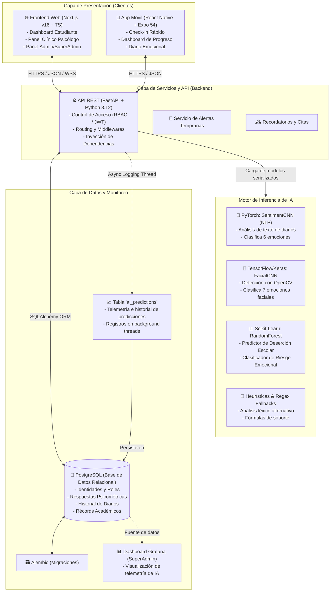

# 🧠 MenTaLink - Arquitectura y Tecnologías del Sistema

Este documento proporciona una especificación técnica detallada de la arquitectura de software y el ecosistema de librerías utilizadas en el proyecto **MenTaLink**, estructurado en cuatro áreas principales: **Frontend Web**, **Backend API**, **Aplicación Móvil (App)** e **Inteligencia Artificial (IA)**.

---

## 🏛️ 1. Arquitectura General del Sistema

MenTaLink está diseñado bajo un enfoque de **Arquitectura Multicapa Distribuida**, optimizado para el procesamiento asíncrono, la seguridad de datos de salud mental (RBAC/GDPR) y la inferencia rápida de modelos de Machine Learning y Deep Learning en producción.

### 📐 Diagrama de Arquitectura (Componentes)

---

### 📂 2. Capas del Sistema

#### A. Capa de Presentación (Frontend Web & App Móvil)
- **Frontend Web (Next.js 16)**: Maneja interfaces de usuario adaptativas según el rol (`student`, `psychologist`, `admin`). Incorpora un panel analítico clínico con gráficos de tendencias de bienestar y alertas estructuradas.
- **Aplicación Móvil (React Native / Expo 54)**: Proporciona a los estudiantes un canal nativo para realizar check-ins diarios rápidos, ver su historial emocional y registrar diarios breves de bienestar.

#### B. Capa de Negocio y API (Backend)
- **FastAPI Core**: Implementa 61 endpoints RESTful expuestos bajo la especificación OpenAPI (Swagger). Mapea autorizaciones JWT asimétricas y roles (RBAC) para limitar la visibilidad de los datos clínicos de manera estricta.
- **Servicios de Agregación**:
  - `StudentHistoryService`: Consolida datos dispersos (académicos y psicológicos) en fichas longitudinales del estudiante.
  - `EmotionalTrendsService`: Agrega tendencias de humor de los últimos 7 días y calcula el **ARI** (Academic Risk Index), ponderando riesgo académico (40%), emocional (40%) y actividad en el sistema (20%).
- **Persistencia en Hilo de Fondo (Asíncrona)**:
  - La telemetría de los modelos de IA se almacena a través de un hilo asíncrono (`Thread` con `daemon=True`) usando la utilidad `log_prediction_to_influx` en la tabla `ai_predictions` de PostgreSQL. Esto previene cuellos de botella e interferencia en el tiempo de respuesta del usuario final (< 200ms) mientras recopila datos para auditorías y tableros externos en **Grafana**.

#### C. Capa de Datos (Data Layer)
- **PostgreSQL**: Motor de bases de datos relacionales robusto para asegurar la atomicidad y coherencia de las transacciones (ej. calificaciones procesuales de hitos H2, H3, H4, H5, respuestas psicométricas PHQ-9, GAD-7, PSS-10).
- **SQLAlchemy ORM**: Mapeo relacional de objetos de Python a tablas SQL, previniendo inyecciones SQL a través de queries parametrizadas.
- **Alembic**: Administrador de migraciones incrementales que asegura la evolución controlada y versionada del esquema.

#### D. Capa de Inferencia e Inteligencia Artificial (IA)
Esta capa encapsula cuatro modelos dedicados cargados en memoria durante el ciclo de vida del servidor:
1. **Análisis NLP de Texto (Diarios)**: Un modelo de **Red Neuronal Convolucional 1D (EmotionCNN)** implementado en **PyTorch** (`model_emotion_cnn.pt`) que clasifica el estado de ánimo en 6 categorías (Feliz, Neutral, Triste, Ansioso, Frustrado, Motivado). Posee un fallback basado en n-gramas y expresiones regulares (`regex_predictor.py`).
2. **Reconocimiento Facial (Marcos de Video)**: Una red convolucional profunda en **TensorFlow/Keras** (`mejor_modelo_emociones.h5`) alimentada a través de OpenCV para detectar rostros con Haar Cascades, procesar imágenes a escala de grises de 48x48 y clasificar 7 expresiones faciales.
3. **Predicción de Deserción Universitaria**: Un clasificador **Random Forest** entrenado en **Scikit-Learn** (`dropout_model.pkl`) que infiere la probabilidad de deserción (0.0 a 1.0) utilizando el rendimiento académico del estudiante (calificaciones de hitos, promedio GPA, becas, estado de pagos) y sus indicadores de bienestar emocional (PSS-10, estado de ánimo semanal). Si el archivo `.pkl` no está presente, ejecuta una fórmula heurística matemática calibrada.
4. **Predicción de Riesgo Emocional**: Clasificador **Scikit-Learn** (`risk_model.pkl`) que toma datos del puntaje de estrés percibido (PSS-10), promedio semanal de check-in, cantidad de días con bajo humor y presión académica autopercibida, catalogándolo en Bajo, Medio, Alto o Crítico.

---

## 📦 3. Pila Tecnológica y Librerías Utilizadas

A continuación, se listan y explican las librerías fundamentales que componen cada subsistema:

### ⚙️ 3.1. Backend API (FastAPI)

El backend de MenTaLink se fundamenta en un stack asíncrono y robusto de Python:

| Librería / Dependencia | Versión | Propósito en el Proyecto |
|-------------------------|---------|--------------------------|
| **`fastapi`** | 0.111.0 | Framework web asíncrono principal para construir la API REST. Proporciona ruteo rápido y generación automática de documentación interactiva (Swagger/ReDoc). |
| **`uvicorn`** | 0.30.1 | Servidor web ASGI de alto rendimiento usado para ejecutar la aplicación FastAPI en desarrollo y producción. |
| **`SQLAlchemy`** | 2.0.31 | Object-Relational Mapper (ORM) de Python. Permite modelar las tablas relacionales de la base de datos como clases de Python y estructurar consultas seguras. |
| **`alembic`** | 1.13.3 | Herramienta de migraciones de base de datos para SQLAlchemy, gestionando de forma incremental la estructura de las tablas en PostgreSQL. |
| **`pydantic`** | 2.7.4 | Librería de validación de datos y análisis de tipos. Asegura que los JSON de entrada y salida cumplan estrictamente con las estructuras definidas en los schemas de la API. |
| **`pydantic-settings`** | 2.3.4 | Extensión de Pydantic para la gestión de variables de entorno y configuraciones del sistema desde un archivo `.env` de forma tipada. |
| **`psycopg2-binary`** | 2.9.9 | Adaptador nativo de PostgreSQL para Python, necesario para permitir la comunicación eficiente entre SQLAlchemy y el motor de base de datos relacional. |
| **`python-jose`** | 3.3.0 | Librería para codificar, decodificar y validar JSON Web Tokens (JWT) requeridos para el sistema de sesiones y tokens de refresco. |
| **`argon2-cffi`** | 23.1.0 | Implementación en Python de Argon2, el algoritmo de hash de contraseñas de última generación recomendado por OWASP para el resguardo de credenciales. |
| **`passlib`** | 1.7.4 | Suite de utilidades para manejo de contraseñas y hashing, proporcionando soporte y transiciones entre hashes legacy (bcrypt) y modernos (Argon2). |
| **`slowapi`** | 0.1.9 | Middleware de rate limiting para proteger la API contra ataques de fuerza bruta y denegación de servicio (DoS), especialmente en endpoints de autenticación. |
| **`sentry-sdk`** | 2.60.0 | Integración con Sentry para la captura automática de excepciones en producción, telemetría de rendimiento y alertas de errores en tiempo real. |
| **`cryptography`** | 42.0.8 | Biblioteca de criptografía para firmas digitales y encriptación de datos sensibles del estudiante. |
| **`python-multipart`** | 0.0.9 | Soporte para el parseo de formularios multipart/form-data, permitiendo la carga de archivos o procesamiento de credenciales via OAuth2 estándar. |
| **`httpx`** | >=0.27.0 | Cliente HTTP asíncrono utilizado para realizar peticiones de prueba y conexiones a servicios de red externos de manera no bloqueante. |

---

### 🤖 3.2. Inteligencia Artificial y Ciencia de Datos (AI/ML)

El motor inteligente combina técnicas clásicas y aprendizaje profundo:

| Librería / Dependencia | Versión | Propósito en el Proyecto |
|-------------------------|---------|--------------------------|
| **`torch` (PyTorch)** | Latest | Motor de Deep Learning. Soporta la inicialización del modelo convolucional de procesamiento de texto `EmotionCNN` y ejecuta la inferencia de emociones de los diarios escritos por los estudiantes. |
| **`tensorflow` / `keras`** | Latest | Utilizado para cargar el modelo pre-entrenado de redes neuronales convolucionales faciales (`mejor_modelo_emociones.h5`) para la clasificación de expresiones en imágenes. |
| **`scikit-learn`** | 1.5.0 | Librería de Machine Learning clásico. Contiene el algoritmo Random Forest utilizado para entrenar y evaluar el predictor de deserción y el clasificador de riesgo emocional. |
| **`opencv-python-headless`** | 4.10.0.84 | Biblioteca de visión artificial (CV2 sin interfaz gráfica). Se encarga de decodificar secuencias Base64 de la cámara, detectar rostros usando Haar Cascades y redimensionar el fotograma a 48x48 píxeles en escala de grises. |
| **`nltk`** | 3.8.1 | Natural Language Toolkit. Se utiliza para la preparación y normalización del texto en el análisis NLP de los diarios (descarga de diccionarios de puntuación, filtrado de stopwords y tokenización). |
| **`pandas`** | 2.2.2 | Herramienta esencial de manipulación de datos. Estructura los inputs del modelo predictivo en DataFrames con las columnas de características alineadas antes de llamar al predictor. |
| **`numpy`** | 1.26.4 | Operaciones numéricas de alto rendimiento y transformaciones matriciales (ej. escalamiento de tensores de imagen para la red convolucional facial de 0 a 1). |
| **`joblib`** | 1.4.2 | Utilizado para deserializar y cargar rápidamente en memoria los archivos de modelos Scikit-Learn de deserción y riesgo emocional (`.pkl`). |
| **`shap`** | 0.45.1 | Proporciona explicabilidad del modelo (SHAP values). Muestra la importancia de cada característica académica o emocional en la predicción final de deserción estudiantil. |
| **`google-genai`** | Latest | SDK de Google para la interacción directa con modelos Gemini AI. Actúa como motor secundario para obtener análisis de sentimientos avanzados en texto complejo. |

---

### 🌐 3.3. Frontend Web (Next.js)

El frontend web interactivo emplea tecnologías modernas orientadas a componentes y alto desempeño:

| Librería / Dependencia | Versión | Propósito en el Proyecto |
|-------------------------|---------|--------------------------|
| **`next`** | ^16.2.6 | Framework web reactivo de React. Soporta Server-Side Rendering (SSR) y Static Site Generation (SSG), facilitando la seguridad y optimización de cargas. |
| **`react` / `react-dom`** | 19.2.0 | Biblioteca central para la creación de componentes declarativos de interfaz de usuario. |
| **`tailwindcss`** | ^4.1.9 | Framework de estilos CSS basado en utilidades de última generación. Facilita la responsividad, el soporte para modo oscuro nativo y una estética premium. |
| **`framer-motion`** | ^12.38.0 | Motor de animaciones fluidas para transiciones de páginas y micro-interacciones (efectos de hover, transiciones en botones, modales dinámicos). |
| **`recharts`** | 2.15.4 | Biblioteca de visualización de datos construida sobre componentes React, empleada para desplegar diagramas de líneas longitudinales del estado de ánimo de los estudiantes. |
| **`lucide-react`** | ^0.454.0 | Paquete de iconos SVG minimalistas y limpios integrados como componentes React. |
| **`zod`** | 3.25.76 | Biblioteca de declaración y validación de esquemas de TypeScript, utilizada para validar los formularios del lado del cliente. |
| **`react-hook-form`** | ^7.60.0 | Manejador del estado y ciclo de vida de los formularios en React, minimizando los re-renderizados innecesarios y facilitando la validación integrada con Zod. |
| **`sonner`** | ^1.7.4 | Biblioteca para el despliegue de notificaciones toast flotantes y avisos contextuales elegantes en la esquina de la pantalla. |
| **`@radix-ui/react-*`** | Varios | Primitivas de interfaz de usuario sin estilos y accesibles (Accordion, Dialog, Select, Accordion, Checkbox, Tooltip, HoverCard), actuando como la base de los componentes del diseño. |
| **`@fontsource/*`** | Varios | Integración local de fuentes tipográficas premium (DM Sans, Lora, Source Serif 4, Space Mono) para optimizar el rendimiento de renderizado de texto. |
| **`@vercel/analytics`** | 1.6.1 | Herramienta de analítica en tiempo real para rastrear interacciones, accesibilidad y tiempos de carga de la aplicación en producción. |

---

### 📱 3.4. Aplicación Móvil (React Native)

La app móvil está optimizada para la interacción rápida en dispositivos móviles iOS y Android:

| Librería / Dependencia | Versión | Propósito en el Proyecto |
|-------------------------|---------|--------------------------|
| **`react-native`** | 0.81.5 | Framework principal para renderizar interfaces móviles nativas a partir de componentes JavaScript/TypeScript. |
| **`expo`** | ~54.0.0 | Plataforma y SDK para el desarrollo y empaquetado ágil de aplicaciones React Native, ofreciendo acceso unificado a APIs del hardware del celular. |
| **`expo-secure-store`** | ~15.0.8 | Almacenamiento encriptado local en el llavero (Keychain) del dispositivo. Se usa para almacenar de forma segura el access token y refresh token de la sesión. |
| **`expo-notifications`** | ^0.32.17 | Servicio para la gestión, registro y recepción de notificaciones push destinadas a recordar a los estudiantes sus evaluaciones programadas. |
| **`expo-device`** | ~8.0.10 | Utilizado para obtener metadatos específicos del hardware del dispositivo para auditorías internas de seguridad. |
| **`expo-haptics`** | ~15.0.8 | API de respuesta táctil (vibración física sutil) para mejorar la usabilidad del estudiante al enviar registros de diarios o check-ins emocionales. |
| **`expo-blur`** | ~15.0.8 | Componente de desenfoque nativo (blur) para interfaces modernas con efectos de vidrio esmerilado (glassmorphism). |
| **`expo-linear-gradient`** | ~15.0.8 | Soporte para fondos con gradientes de color suaves que aportan al aspecto estético premium de la app. |
| **`lucide-react-native`** | ^0.400.0 | Adaptación móvil de los iconos SVG minimalistas de Lucide. |
| **`react-native-svg`** | ^15.12.1 | Permite el renderizado de gráficos vectoriales SVG personalizados dentro del entorno de React Native. |
| **`react-native-safe-area-context`** | ~5.6.0 | Biblioteca para manejar de forma segura los márgenes del notch, barras de estado y bordes curvos de dispositivos modernos de pantalla completa. |
| **`@expo-google-fonts/*`** | * | Fuentes web pre-configuradas de Google Fonts (Manrope, Noto Serif) para uniformar la identidad tipográfica en la aplicación móvil. |

---

## 🔒 4. Consideraciones de Seguridad y Auditoría

La arquitectura incorpora medidas avanzadas de protección de datos:
- **Seguridad Relacional Activa**: Los usuarios son identificados y verificados estrictamente por su rol en cada petición API mediante `RoleChecker` (Admin, Psicólogo, Estudiante).
- **Separación de Predicciones**: Los datos de predicción crudos de los modelos de IA se almacenan para telemetría técnica pero **no se exponen a los estudiantes** a fin de evitar profecías autocumplidas, angustia secundaria o sesgos de confirmación, cumpliendo con principios éticos de la inteligencia artificial.
- **Audit Logs Inmutables**: La tabla `ai_predictions` y los registros de acceso capturan marcas de tiempo UTC, ID de usuario, y variables analizadas para propósitos forenses y de ajuste continuo de modelos por parte de la administración.
